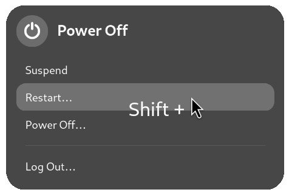

# One-Click BIOS

A GNOME extension that allows you to restart into firmware settings directly from OS. 

| Current Support | Historical Support[^1] |
|-----------------|------------------------|
| 46, 47          | 43                     |

## Usage:
1. Open the power menu as usual
2. Hold <kbd>Shift</kbd> and click the "Restart..."
3. The computer will now restart straight into your BIOS/UEFI settings automatically!

[^1]: Will not receive updates.
