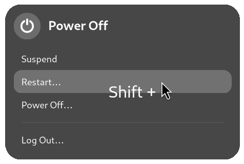

# One-Click BIOS

A GNOME extension that allows you to restart into firmware settings directly from OS. 

| Current Support | Historical Support[^1] |
|-----------------|------------------------|
| 46 – 51         | 43                     |

## Usage:
1. Open the power menu as usual
2. Hold <kbd>Shift</kbd> and click the "Restart..."
3. The computer will now restart straight into your BIOS/UEFI settings automatically!

## Supported GNOME versions
At a minimum, this extension supports the GNOME versions shipped by:
- The **two** latest Ubuntu LTS releases
- The latest Debian release
- The latest RHEL release
- The latest SLES / openSUSE Leap release
- The latest Fedora Beta (the upcoming Fedora release, not Rawhide).

The supported range is from the oldest GNOME version to the latest GNOME version used among the above list, and is reviewed whenever one of these distributions has a new release. GNOME versions that are no longer supported can still install the last release of this extension that supported them from GNOME Extensions.

[^1]: Will not receive updates.
